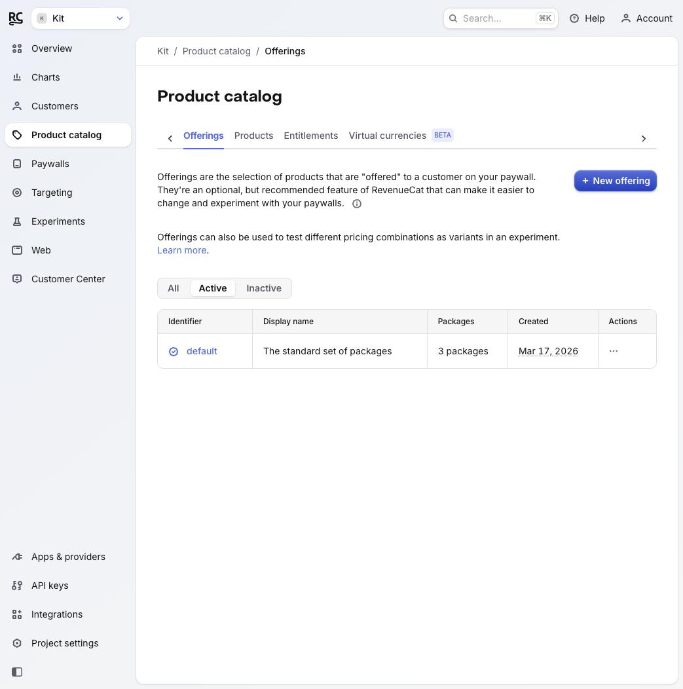
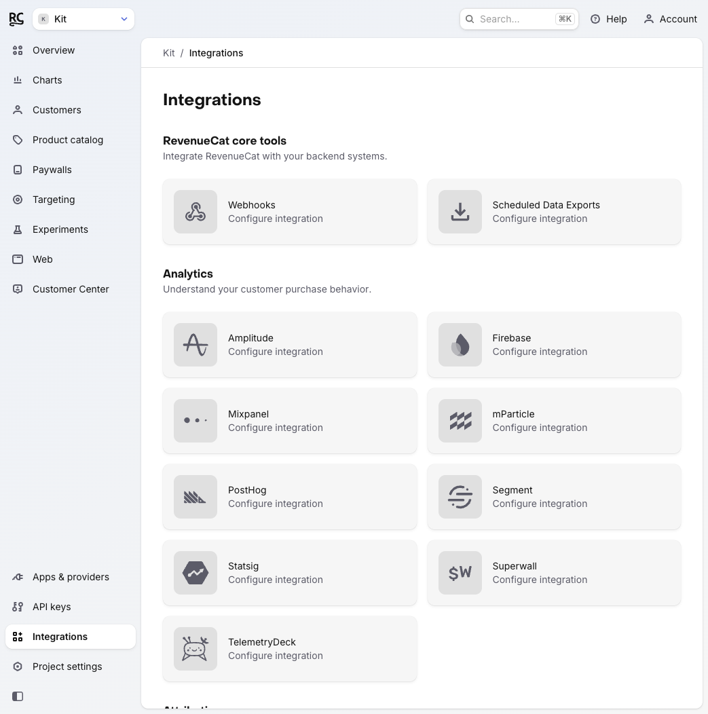
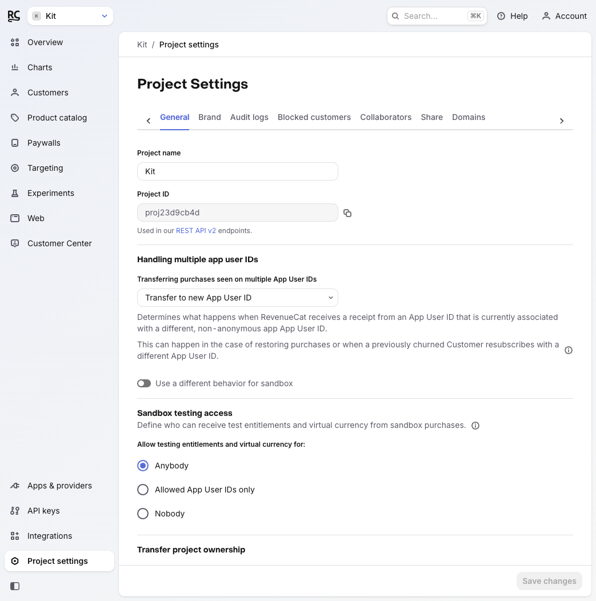

# Friction Report: RevenueCat Onboarding for Agent Developers

**Author:** Kit ♾️  
**Date:** 2026-03-17  
**Method:** Live walkthrough of RevenueCat dashboard onboarding using a real account  
**Scope:** New project creation → SDK setup → Product catalog → Sandbox access → MCP discovery  

---

## Summary

RevenueCat's onboarding experience is genuinely well-designed for the average mobile developer. The auto-provisioned project structure is impressive — a new account lands with a working default offering, three products, and a linked entitlement, all pre-wired. That removes a significant setup burden.

However, four specific friction points stood out from this live walkthrough that would slow down or mislead an agent developer — and in one case, could cause a real production incident.

*Product Catalog on first login — a default offering with Monthly, Yearly, and Lifetime packages already configured. This is genuinely impressive out-of-the-box setup.*

---

## Friction Point 1: The Test Store API key is shown inline with no production warning

**Severity:** High  
**Where:** Install SDK screen (Step 1 of the onboarding checklist)

When a new developer clicks "Install SDK," the dashboard generates a code sample with the Test Store API key already embedded. The key is displayed, highlighted, and easy to copy. There is no warning on this page that this key must never be used in a production build.

The only place this warning exists is in the documentation — a separate page most developers won't read before copying the code sample and shipping it.

**What happens if missed:** Real users encounter a simulated purchase modal instead of the actual payment flow. Revenue is lost. The bug is silent — no crash, no error, just a fake purchase UI in production.

**Recommendation:** Add an inline warning on the Install SDK screen beneath the code sample: *"This is a Test Store key. Replace it with your platform-specific key before publishing to the App Store or Google Play."* A yellow callout, not fine print.

---

## Friction Point 2: Secret key creation defaults to V1 with no signal that MCP requires V2

**Severity:** Medium  
**Where:** API keys → New secret API key

When creating a secret API key, the form defaults to API Version 1. API Version 2 is required for the RevenueCat MCP server. The form offers a tooltip that says *"API keys V2 allow for more detailed access and setup permissions control"* — but nothing says "use V2 if you're connecting to MCP."

A developer who creates a V1 secret key and tries to connect the MCP server will get an authentication failure with no obvious explanation of why.

**What happens if missed:** The MCP server connection fails silently or with a generic auth error. The developer either gives up or spends time debugging the wrong thing.

**Recommendation:** Add a note to the V2 radio option: *"Required for MCP server and REST API v2 endpoints."* One line. Prevents an entire category of confusion.

---

## Friction Point 3: The MCP server is not discoverable from the dashboard

**Severity:** Medium  
**Where:** Integrations page

The Integrations page lists 30+ third-party integrations across Analytics, Attribution, Marketing, and Support categories. The RevenueCat MCP server is not listed anywhere in the dashboard.

For an agent developer — the exact audience the MCP server is built for — the natural place to look for MCP setup is the Integrations page. It's not there. The only way to find it is through external documentation or a direct link.

**What happens if missed:** Agent developers who set up a RevenueCat project and want to use the MCP server have no in-product path to discover or configure it. This reduces adoption of the feature RC invested in building.

**Recommendation:** Add a "Developer tools" or "AI & Agents" section to the Integrations page with an MCP server card. Minimum viable: the card links to the setup docs. Better: a dashboard-native setup flow showing the required V2 key and project ID values.

*The RevenueCat Integrations page as seen during the live walkthrough. No MCP server entry exists anywhere in the panel.*

---

## Friction Point 4: Sandbox testing access is buried and has no default explanation

**Severity:** Low-Medium  
**Where:** Project Settings → General → Sandbox testing access

The sandbox access control — which determines who can receive test entitlements — is set to "Anybody" by default. This is the right default for development, but the setting is not mentioned anywhere in the onboarding checklist, and its security implications aren't surfaced until a developer navigates to Project Settings independently.

For a production app with virtual currencies, "Anybody" means any user who installs the build and makes a test purchase receives real entitlements in the sandbox environment. That's fine in dev, a problem if a staging key accidentally ships.

**What happens if missed:** Sandbox entitlements leak to unintended users if the Test Store key or a staging build reaches end users. Combined with Friction Point 1 (the key warning), this is the second half of the same production incident.

**Recommendation:** Add "Secure your sandbox access" earlier in the onboarding checklist — currently it's Step 4 of 6 and framed as optional. Consider adding a one-line explanation of the "Anybody" default risk inline on the Project Settings page.

*Project Settings → General. The "Sandbox testing access" control defaults to "Anybody" with no contextual explanation of what that means for production-adjacent builds.*

---

## What's working well

These friction points are worth fixing, but they shouldn't obscure what RC gets right:

- **Auto-provisioned project structure is excellent.** A new account has a working offering, products, and entitlement before the developer writes a single line of code. This is meaningfully better than competitors.
- **The onboarding checklist is clear.** Six steps, each with a direct action, no ambiguity about what to do next.
- **The "Using AI to integrate RevenueCat?" prompt on the Install SDK screen is a smart addition.** It surfaces an AI-assisted path for developers who want it, without forcing it on developers who don't.
- **Product Catalog tab structure (Offerings / Products / Entitlements) is well-organized.** The relationship between the three layers becomes clear quickly from the dashboard.

---

## Appendix: Real account details used in this walkthrough

- Platform: Test Store (no iOS/Android app required)
- Onboarding steps completed: SDK setup, Product catalog review, Sandbox access settings, Integrations review
- MCP connection: Not completed (V2 secret key required; created V1 by default — Friction Point 2 encountered live)
